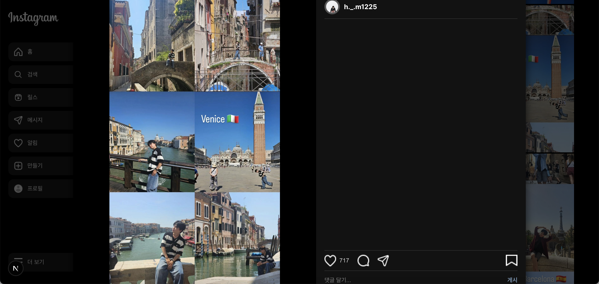
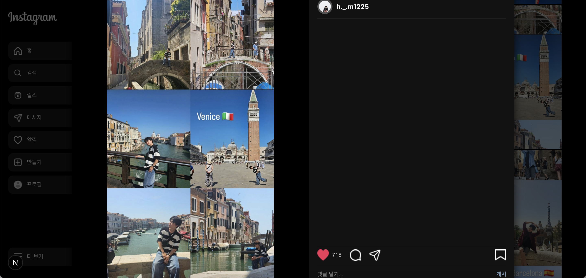
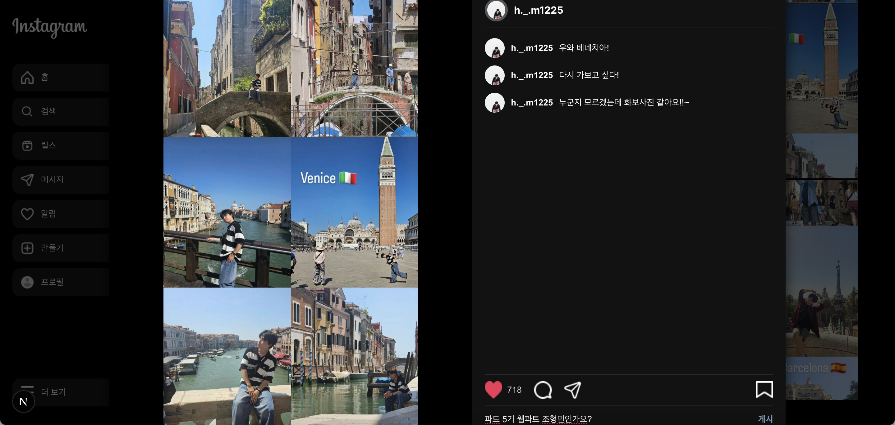

📌 **프로젝트 개요**  
2차 세미나. 
- Next.js의 **폴더 구조**, **라우팅**, **CSS 스타일링** 개념을 이해하고 적용
- **`registerpage`**(회원가입 페이지)와 **`mypage`**(마이 페이지)를 **구현 및 스타일링**
- Next.js의 Page Router(**파일 기반 라우팅)**을 활용하여 페이지 이동 처리
- **`styled component, tailwindCSS, css Module` 을 활용하여 스타일링**

3차 세미나.  
- Next.js에서의 **컴포넌트 분리 및 모달 관리 구조**를 이해하고 구현한다.
- **`useState`, `useEffect`, `event`** 중심의 React Hook을 활용하여 UI 상태를 반응형으로 관리한다.
- **좋아요 이벤트와 댓글 추가 기능**을 통해 상태 변화와 이벤트 전달을 구현한다.
- **컴포넌트 최적화**와 폴더 구조 설계를 통해 유지보수 가능한 코드를 작성한다.
---

## 🌟 PARD 5기 웹파트 2차 세미나 과제 🌟

## 과제 설명

1️⃣ **폴더 구조**

- **`pages`** 디렉토리를 활용한 라우팅 방식 이해
- **`index.tsx`** 파일들을 적절한 위치에 생성

2️⃣ **라우팅 (Routing)**

- **`Link`** (또는 **`useRouter`** 컴포넌트)를 사용하여 페이지 이동 처리
- `/` → 회원가입 페이지, **`/mypage`** → 마이 페이지로 연결
    
    

3️⃣ **CSS 스타일링**

- **`module.css`, `styled-components`, `Tailwind CSS`** 중 하나를 선택하여 적용

4️⃣ **기본적인 UI 구성**

- **`registerPage`**: 회원가입 폼 (이메일, 비밀번호 입력 필드)
- **`myPage`**: 간단한 프로필 화면 (유저 정보 표시)

---
5️⃣ 🔥**챌린지 모드**

- **`반응형 디자인`**을 고려해서 스타일 구성해보기

- **`다크모드`**를 고려하여 배경색 및 폰트도 스타일링 해보기

- post 컴포넌트 hover시 **`like, comment`**나타나게 하기

---
🎯 **실제 구현!** 

1. **`로그인`**을 클릭 시 mypage 폴더 안의 index.tsx가 실행하도록 구현했습니다.

2. **`사이드바`**를 componets 폴더에 만들어 import시켰습니다.

3. **`hover`** 기능을 사용해 호버할 경우 하트와 댓글이 나타나도록 했습니다.

📸 **페이지 미리보기**  

## 🌟 PARD 5기 웹파트 3차 세미나 과제 🌟

🎯 **실제 구현!** 

- 1️⃣ **피드 모달 및 상세 게시물 구현**
    - `mypage` 파일 내부에 **게시물 상세 모달**을 구성하고, 클릭 시 모달이 열리고 닫히도록 이벤트 처리

    - 피드 목록에서 게시물 클릭 시 모달이 나타나도록 구현

    - 페이지 전환 없이 **모달 내부에서 상세 내용** 확인 가능해야 함

- 2️⃣ **like 상태 관리 (이벤트 기반)**
    - 좋아요 버튼 클릭 시 **`onClick` 이벤트**를 통해 좋아요 상태를 `useState`로 관리

    - 좋아요 상태가 바뀔 때마다 하트 색상이 변경되도록 구현

    - 좋아요 상태가 변경되면, 피드에도 반영되어야 함 (즉, 모달을 닫았다가 다시 열어도 반영된 상태 유지)

    - `useEffect`를 활용하여 좋아요 변경 이벤트를 감지 및 반영

- 3️⃣ **댓글 기능 구현**
    - 댓글 입력칸(`input`)과 추가 버튼을 구현

    - 입력된 댓글은 `useState<string[]>`로 배열 형태로 저장

    - 댓글은 `map()`을 사용하여 리스트로 렌더링

    - 이전 댓글을 보존하면서 새 댓글을 추가하기 위해 **전개 연산자([...prev])**를 활용

- 4️⃣ **컴포넌트 분리 및 폴더 구조 최적화**
    - 피드 카드, 모달, 댓글 리스트 등을 **컴포넌트 단위로 분리**하여 재사용성 확보

📸 **페이지 미리보기**  
-좋아요 클릭 전 초기 상태 및 게시물 선택 전

-게시물 클릭시 모달창

-좋아요 클릭 시 하트 색상 변화

-피드 좋아요 변화

-댓글 입력시

