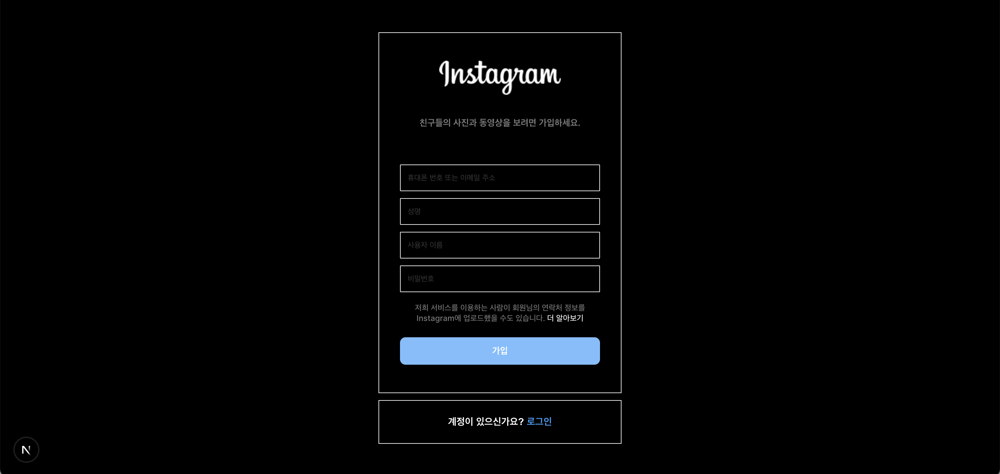
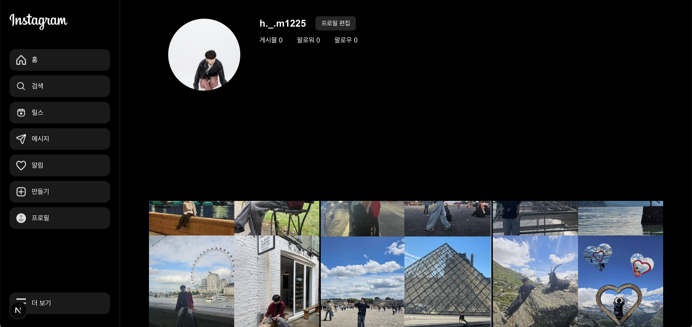

## 🌟 PARD 5기 웹파트 2차 세미나 과제 🌟

## 과제 설명

1️⃣ **폴더 구조**

- **`pages`** 디렉토리를 활용한 라우팅 방식 이해
- **`index.tsx`** 파일들을 적절한 위치에 생성

2️⃣ **라우팅 (Routing)**

- **`Link`** (또는 **`useRouter`** 컴포넌트)를 사용하여 페이지 이동 처리
- `/` → 회원가입 페이지, **`/mypage`** → 마이 페이지로 연결
    
    

3️⃣ **CSS 스타일링**

- **`module.css`, `styled-components`, `Tailwind CSS`** 중 하나를 선택하여 적용

4️⃣ **기본적인 UI 구성**

- **`registerPage`**: 회원가입 폼 (이메일, 비밀번호 입력 필드)
- **`myPage`**: 간단한 프로필 화면 (유저 정보 표시)

---
5️⃣ 🔥**챌린지 모드**

- **`반응형 디자인`**을 고려해서 스타일 구성해보기

- **`다크모드`**를 고려하여 배경색 및 폰트도 스타일링 해보기

- post 컴포넌트 hover시 **`like, comment`**나타나게 하기

---
🎯 **실제 구현!** 

1. **`로그인`**을 클릭 시 mypage 폴더 안의 index.tsx가 실행하도록 구현했습니다.

2. **`사이드바`**를 componets 폴더에 만들어 import시켰습니다.

3. **`hover`** 기능을 사용해 호버할 경우 하트와 댓글이 나타나도록 했습니다.

📸 **페이지 미리보기**  

